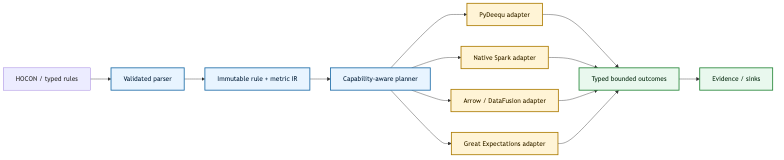

= ADR-002: Own an engine-neutral rule kernel
:toc:
:sectlinks:

Status: Proposed +
Date: 2026-09-20

== Context

The framework currently exposes PyDeequ concepts through configuration, builders,
engine implementations, timestamps, result rows, and repository behavior. This makes a
nominally pluggable framework dependent on one Python wrapper and one JVM library.
Great Expectations has a richer user-facing validation vocabulary, Deequ efficiently
combines analyzers over Spark, Spark provides distributed relational execution, and
Apache Arrow/DataFusion provide a portable columnar memory and query substrate. None of
those projects should become the framework's domain model.

Reimplementing a DataFrame runtime or distributed statistics package would create a large
correctness and maintenance burden. The component we need to own is the small, stable
semantic layer between rules and execution engines.

== Decision

Build an immutable, engine-neutral rule kernel and retain external systems as physical
execution adapters. The accompanying dependency change targets PyDeequ 1.7 as the Spark 3.5
adapter. The initial opt-in count-plan kernel is implemented in `dq.plan`; a native Spark
adapter (`dq.spark_adapter`) executes the size/completeness subset with demonstrated
counts/v1 parity against PyDeequ (differential suite covering sizes, nulls, decimals,
empty inputs, exact thresholds, and the documented NaN divergence), and
`dq.portable_config` translates exactly representable HOCON count rules. DataFusion and
non-count-rule compilers remain planned. Adoption of the broader architecture remains
proposed until the wider rule subset reaches the same bar.

The kernel owns:

* dataset and column references with validated identifiers;
* rule specifications such as completeness, uniqueness, range, pattern, size,
  freshness, referential integrity, schema, and distribution checks;
* reusable metric requests and threshold predicates;
* severity, hints, stable rule identity, and deterministic ordering;
* an execution plan that deduplicates compatible scans and aggregations;
* typed outcomes, provenance, capability errors, and evidence serialization.

Adapters own:

* compilation of supported rules to PyDeequ, Spark SQL/DataFrame expressions,
  Great Expectations, or DataFusion logical expressions;
* physical execution, partitioning, spill, pushdown, and runtime-specific tuning;
* conversion of runtime results into the kernel's typed outcomes.

Arrow is the preferred interchange contract for bounded tabular results and local or
embedded engines. It is not the universal execution API: Spark datasets remain distributed
and must not be collected merely to cross an Arrow boundary. A DataFusion adapter may consume
Arrow datasets, record batches, object-store tables, or SQL plans directly.

== Core data structures

[cols="1,2,2",options="header"]
|===
|Structure |Shape |Reason

|`ExecutionPlan`
|Frozen tuple of dataset-scoped `RuleSpec` values and required metrics
|Hashable, deterministic, cacheable, and safe to share.

|`RuleSpec`
|Tagged immutable values with validated column references and predicate values
|Avoids strings containing executable Python or adapter-specific method names.

|`MetricKey`
|Dataset, metric kind, columns, filter, and parameters
|Lets the planner deduplicate metrics and combine scans.

|`CapabilitySet`
|Adapter name/version plus supported rule and semantic flags
|Fails before execution when an adapter cannot preserve rule semantics.

|`CheckOutcome`
|Stable rule ID, status, metric value, threshold, bounded diagnostics, and provenance
|One result contract across engines and durable evidence stores.
|===

== Semantic rules

The same rule must mean the same thing across adapters. Null/NaN handling, regex dialect,
decimal precision, timestamp zones, approximate algorithms, empty datasets, and uniqueness
semantics are explicit plan fields or capability flags. The compiler rejects unsupported
semantics; it must not silently approximate or reinterpret them.

Row-level diagnostics are opt-in and bounded. An adapter may return counts, sampled stable
row identifiers, or an engine-owned quarantine reference, but never unbounded records in the
driver outcome.

== Distributed execution and durability

Dataset handles describe immutable input identity, schema, partitioning, and the owning runtime;
they need not contain in-memory rows. Arrow batches are a local streaming interchange boundary.
Arrow does not supply scheduling, global aggregation, or exactly-once execution, and embedded
DataFusion by itself is not a replacement for Spark's cluster scheduler.

The planner distinguishes mergeable metrics (counts, sums, min/max, variance states),
shuffle-dependent checks (exact uniqueness, foreign keys), ordered checks (rate of change),
and approximate sketches. Global distinct counts must never be computed by summing partition
distinct counts. Adapters document approximation error and merge semantics; changes in partition
count must preserve exact results and the declared tolerance for approximate results.

PostgreSQL is a proposed durable sink for run identity, versioned plans, metric summaries,
outcomes, and provenance. Persist the execution status and outcomes transactionally with an
idempotency key based on input identity, rule version, and semantic version. Workers retry
idempotently; a partial run must never become passing evidence. Large quarantined datasets
remain in dataset storage, referenced by identity and checksum. This sink is delivery unit U6,
not an existing guarantee.

== Portability and delivery boundaries

[cols="2,2,3",options="header"]
|===
|Capability |Initial implementation |Promotion gate
|Size, completeness, numeric range
|PyDeequ; native Spark for size/completeness (`dq.spark_adapter`)
|Shared empty/null/NaN/decimal fixtures and one-scan plan checks; differential suite passing with the documented NaN divergence
|Uniqueness and foreign keys
|Existing Spark/Deequ paths
|Explicit duplicate/null definitions; partition-invariant differential tests
|Regex, freshness, ordered checks
|Adapter-specific until semantics match
|Regex dialect, timezone/reference clock, and deterministic ordering contracts
|DQDL and vendor expectations
|Compatibility adapters
|Do not promise automatic translation of arbitrary vendor rules into portable IR
|Arrow/DataFusion
|Planned embedded adapter
|Parity for the first rule subset plus measured memory/runtime benefit
|===

== Migration

. Introduce typed `RuleSpec`, `MetricKey`, `CheckOutcome`, and legacy HOCON/result adapters.
. Compile the existing Deequ configuration into typed rules while preserving `dq-report/v1`.
. Add a native Spark compiler for a narrow parity set: size, completeness, uniqueness,
  range, pattern, and schema checks.
. Run native Spark and PyDeequ in differential tests over generated and edge-case datasets.
. Add Arrow/DataFusion only for rules with proven semantic parity and benchmark value.
. Keep Great Expectations and PyDeequ as optional compatibility adapters; deprecate direct
  adapter method strings once the typed configuration format is stable.
. Consider a Rust kernel through PyO3 only if profiling shows planning or local Arrow
  execution is material. Python immutable models are sufficient initially.

== Consequences

Benefits include library independence, deterministic validation, cheaper adapter testing,
single-scan planning, and a path from Spark to Arrow-shaped workloads without a flag day.
The costs are a semantic compatibility suite, explicit capability negotiation, and a period
where legacy and typed configurations coexist.

We deliberately do not build a new DataFrame implementation, distributed scheduler, storage
engine, or expression evaluator. Those remain delegated to mature runtimes.

== Acceptance gates

* Kernel types import with no Spark, PyDeequ, Great Expectations, or DataFusion installed.
* Every adapter passes shared semantic contract and negative capability tests.
* Differential fixtures cover nulls, NaN, decimals, time zones, empty inputs, skew, and
  partition changes.
* Plans never materialize unbounded distributed rows at the driver boundary.
* PyDeequ can be removed from an installation without changing kernel configuration or
  outcome types.

== Primary references

* Deequ analyzers and Spark execution: https://github.com/awslabs/deequ
* PyDeequ 1.7 changes: https://github.com/awslabs/python-deequ/releases/tag/v1.7.0
* Great Expectations validation concepts: https://docs.greatexpectations.io/docs/core/introduction/
* Arrow memory and interchange format: https://arrow.apache.org/docs/format/Columnar.html
* DataFusion query engine and Arrow integration: https://datafusion.apache.org/user-guide/introduction.html
